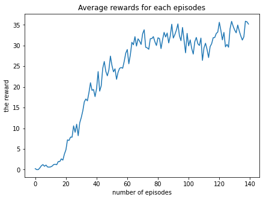

# Project  Report

In this project, the Deep Deterministic Policy Gradient algorithm named [DDPG](https://spinningup.openai.com/en/latest/algorithms/ddpg.html) is implemented 
to train an agent for controlling a double-jointed arm. The below figure shows the outcome of this project via using the graphics.
The agent before training is seen in the left side, and the trained one is in the right side.

Before Training            |  After Training
:-------------------------:|:-------------------------:
            |  

### Environment
Unity's ML Agents package is utilized in the project to train the agent on the environment named Reacher. In this environment, 
20 double-jointed arms are placed on the platform. Their initial configurations are randomly determined.
This agent perceives a 33-dimensional vector as its own state to keep information of velocity, angular velocity, rotation, and position of the arm. And, the action made in each step is 4-dimensional for two joints whereas every entry in the action vector should be a number between -1 and 1. 
The goal of this task is to control double-jointed arms in the target regions so that the average mean score is more than 30.0 over 100 consecutive episodes of 20 agents. For each time step, reward is +0.1 if the agent is successful to put a double-joint arm in the target region.

### Methodology
The DDPG is an algorithm in which there are 2 artificial neurol networks for both: actor and critic. It can bee too complex depending on a task. In this project, we keep it simple since our environment provides us state values in 33-dimensional space. 
DDPG algorithm is implemented by using **Pytorch** and **Python 3**. The neural network architecture of **Actor** has 2 fully connected layers(32 and 128 units) followed by ReLu actiovations except the last layer(tanh activation) which outcomes a 4-dimensional vector for an action.
The neural network architecture of **Critic** has 2 fully connected layers(32 and 128 units) followed by ReLu actiovations except the last layer which outcomes a Q-value. In this network, representaions of the first hidden layer are concataned to action values of Actor network. Then, they are fed to the second hidden layer. Adam optimizer is selected for both neural networks.

  - Replay Buffer  : Our agent takes actions orderly. Therefore, probability of selecting the next action may be affected by the previous one. To eliminate this correlation effect we utilize the replay buffer which is a fixed size buffer to store experiences.
  - Fixed Q-Targets: Two identical Q-Networks are created for the agent: a local and a target. The local network is softly updated every **n** steps with parameters of the target network. In this way, similar to replay buffer, we can decrease correlation among selection of actions. 

These techniques are utilized to train out banana collector agent. Due to simplicity of the input state and the network we mentioned above, we prefer to use CPU in order to train our agent.

### Results
We used the hyperparameters as the following:
 - BUFFER_SIZE = int(1e5)  # replay buffer size
 - BATCH_SIZE = 4*2048     # minibatch size
 - GAMMA = 0.99            # discount factor
 - TAU = 1e-3              # for soft update of target parameters
 - LR_ACTOR = 1e-4         # learning rate of the actor 
 - LR_CRITIC = 1e-3        # learning rate of the critic
 - WEIGHT_DECAY = 1e-6     # L2 weight decay
 - SIGMA_DECAY = 0.9       # Decay for noise
 - SIGMA_MIN = 0.001       # Min sigma value of noise
  
Our agent is capable of solving the task after the episode **495**. The result of the DDPG algorithm is the following:  
  > 
  
The average score value is calculated by averaging scores of averga20 agents in the last 100 episodes.

### Conclusion
Using Pytorch and Unity's ml-agents in this project is quite impressive. The followings can be done as a future work:

  - Grid search can be applied to find the optimum hyperparameters
  - PPO, A3C, and D4PG approaches can be implemented.

